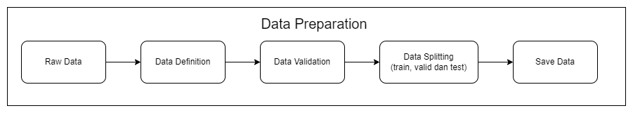
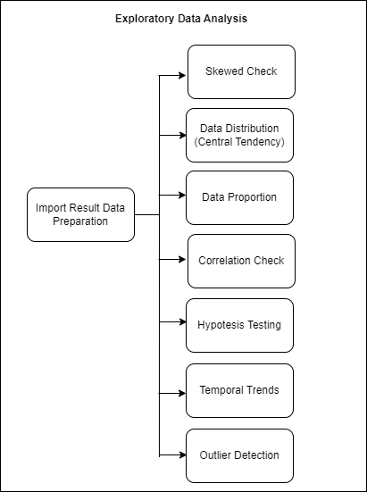
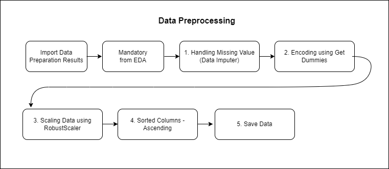
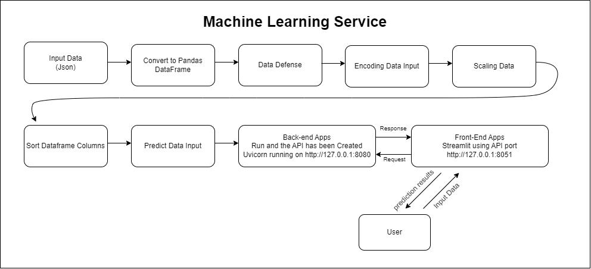
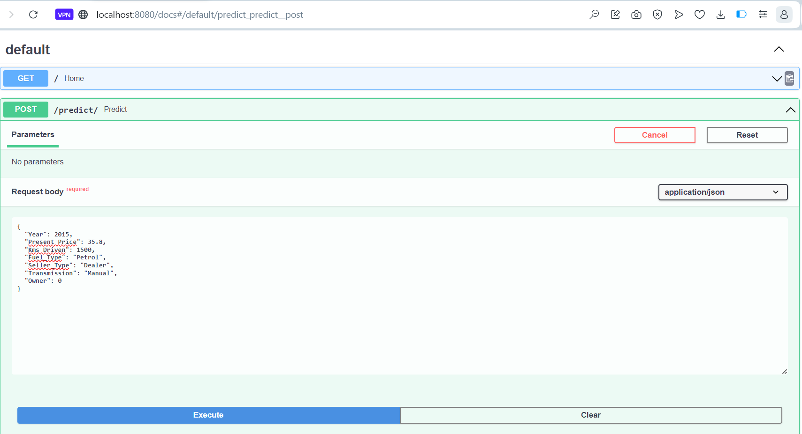
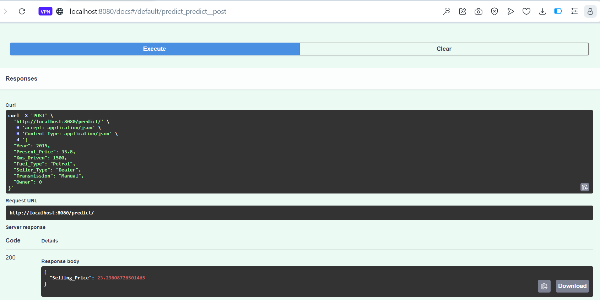
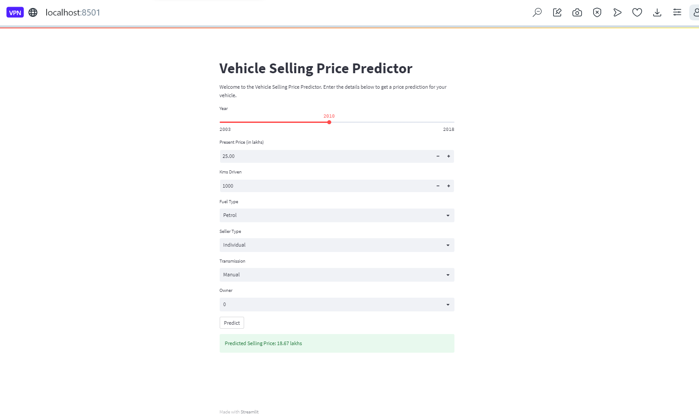
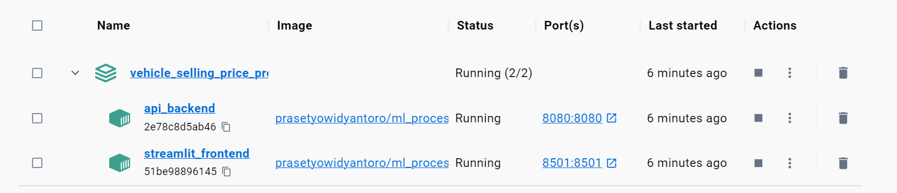
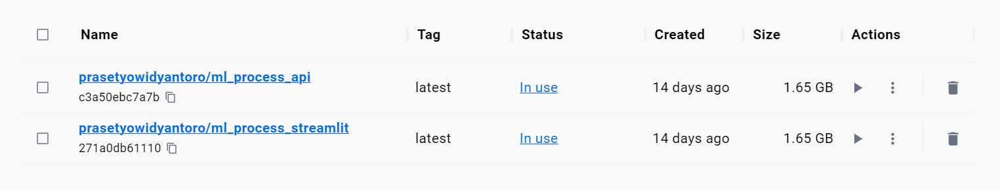

# Predicting Vehicle Prices using Machine Learning 

- `Link Dokumentasi` : 
- `Link Medium` : https://medium.com/@prasetyow938/predicting-vehicle-prices-using-xgboostregressor-d1bcdaa411fc
- `Link Youtube` : -

## Cara Menjalankan Service

## Cara menjalankan Script Dilokal dengan Dua Terminal Sekaligus

### Konfigurasi Awal
- Buat satu folder untuk clone file-file yang tersedia pada laman github ini
- clone repository github ini
- instalasi virtual environment
- aktifkan virtual environment yang telah dibuat
- install requirements.txt dengan cara `pip install -r requirements.txt`
- file sudah dikonfigurasi, lanjutkan step dibawah ini sesuai dengan keinginan

### Cara Menjalankan API

- Pastikan masuk ke folder utama program
- ketik - `python src/api.py`
- lalu akan dirujuk pada laman `http://127.0.0.1:8080`

### Cara Menjalankan Streamlit
- edit pada file src/streamlit pada bagian dari yang sebelumnya 
- `response = requests.post("http://api:8080/predict/", json=data)` menjadi ini
- `response = requests.post("http://localhost:8080/predict/", json=data)`
- Pastikan masuk ke folder utama program
- ketik - `streamlit run src/streamlit.py`
- lalu akan diarahkan pada tampilan UI streamlit pada laman `http://localhost:8501/`

### Cara serve MkDocs
- Pastikan sudah berada didalam folder docs
- ketik - `mkdocs serve`
- lalu laman dokumen akan muncul pada laman `http://127.0.0.1:8000`

### Cara menjalankan Sevice dengan menggunakan Docker

Langkah langkah menggunakan menjalankan service dengan menggunakan docker:

* pastikan docker sudah diaktifkan dan dalam kondisi login
* lalu, jalankan melalui terminal yang sudah diaktifkan virtual environment dengan script berikut `docker compose up -d --build`
* pastikan script `src/streamlit` pada pemanggilan api menggunakan script dibawah ini
- `response = requests.post("http://api:8080/predict/", json=data)`
* Selesai service sudah bisa digunakan

##  Data Preparation

**Gambar Arsitektur Data Preparation**

### Data Definition
Data yang digunakan merupakan data yang menggambarkan karakteristik vehicle berdasarkan harga jualnya. adapun fitur karakteristik vehicle yang digunakan antara lain

Predicting Vehicle Prices saat ini menggunakan data yang disadur dari kaggle dengan laman :

[https://www.kaggle.com/code/anandtalware/vehicle-sale-price-prediction-9-sept-2023/input?select=car+data.csv]
(https://www.kaggle.com/code/anandtalware/vehicle-sale-price-prediction-9-sept-2023/input?select=car+data.csv)

Data berisi 301 baris dan 8 kolom yaitu :

* Year : Tahun saat mobil tersebut dibeli
* Selling_Price : Harga saat mobil tersebut dijual
* Present_Price : harga mobil bekas showroom saat ini
* Kms_driven : Jarak tempuh yang sudah dilalui mobil tersebut
* Fuel_Type : Jenis bahan bakar mobil 
* Seller_Type : Tipe Penjual, perorangan atau dealer
* Transmission : Jenis Transmisi oper gigi mobil, manual atau otomatis
* Owner : Jumlah pemilik mobil sebelumnya.

`Year :
[int64]
[2003–2018]
Tahun saat mobil tersebut dibeli`

`Selling_Price :
[float64]
[0.1–35.0]
Harga saat mobil tersebut dijual`

`Present_Price :
[float64]
[0.32–92.6]
Harga mobil bekas showroom saat ini`

`Kms_driven :
[int64]
[500–500000]
Jarak tempuh yang sudah dilalui mobil tersebut`

`Fuel_Type :
[object]
[‘Petrol’ ‘Diesel’ ‘CNG’]
Jenis bahan bakar mobil`

`Seller_Type :
[object]
[‘Dealer’ ‘Individual’]
Tipe Penjual, perorangan atau dealer`

`Transmission :
[object]
[‘Manual’ ‘Automatic’]
Jenis Transmisi oper gigi mobil, manual atau otomatis`

`owner :
[int64]
[0, 1, 3]
Jumlah pemilik mobil sebelumnya.`

## Exploratory Data Analysis (EDA)

**Gambar Arsitektur Exploratory Data Analysis (EDA)**

    

## Data Preprocessing

**Gambar Data Preprocessing**

## Data Modeling

**Gambar Arsitektur Data Modeling**

## Machine Learning Services

**Arsitektur Machine Learning Services**

Selanjutnya, setelah melalui beberapa proses dan model telah di save akan dilanjutkan pada deployment dengan menggunakan API dan Streamlit gambar dibawah ini merupakan contoh mengakses menggunakan ML Services melalui FAST API Swagger UI

Berikut contoh input data yang digunakan untuk mengakses API

Berikut hasil output prediksi dari API services

Agar lebih ramah dalam menggunakannya dan tampilannya lebih powerfull, user disuguhkan dengan apps sederhana yang dibangun dengan menggunakan streamlit services, berikut contoh penggunaannya

User diharapkan mengisi form yang sudah disediakan hingga selesai, jika terdapat kesalahan range dalam input data streamlit akan menampilkan error dibagian mana yang inputnya salah, jika dirasa sudah sesuai kriteria maka klik tombol `predict` dan akan mengelarkan hasil prediksi harga kendaraan.

## Menggunakan Docker Container
Ketika service ingin dijalankan bersamaan, maka kita perlu menggunakan tools yang mendukung hal tersebut, salah satunya dapat menggunakan docker berikut contoh service sederhana yang dijalankan dengan bantuan docker

Berikut hasil input service ke docker container

Berikut hasil input service ke docker Image

## Reference

* https://machinelearningmastery.com/xgboost-for-regression/
* https://xgboost.readthedocs.io/en/stable/parameter.html
* https://towardsdatascience.com/xgboost-theory-and-practice-fb8912930ad6
* https://medium.com/hoyalytics/xgboost-theory-and-application-4801a5dba4fb
* Afandizadeh, S., Sharifi, D., Kalantari, N., & Mirzahossein, H. (2023). Using machine learning methods to predict electric vehicles penetration in the automotive market. Scientific Reports, 13(1). https://doi.org/10.1038/s41598-023-35366-3
* Krishnan, J. R., & Selvaraj, V. (2022). Predicting Resale Car Prices Using Machine Learning Regression Models With Ensemble Techniques. AIP Conference Proceedings, 2516. https://doi.org/10.1063/5.0108560
* Kriswantara, B., & Sadikin, R. (2022). Used Car Price Prediction with Random Forest Regressor Model. Journal of Information Systems, Informatics and Computing Issue Period, 6(1), 40–49. https://doi.org/10.52362/jisicom.v6i1.752
* MUTİ, S., & YILDIZ, K. (2023). Using Linear Regression For Used Car Price Prediction. International Journal of Computational and Experimental Science and Engineering, 9(1), 11–16. https://doi.org/10.22399/ijcesen.1070505