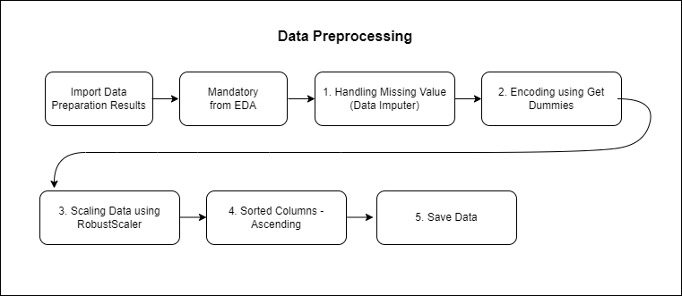
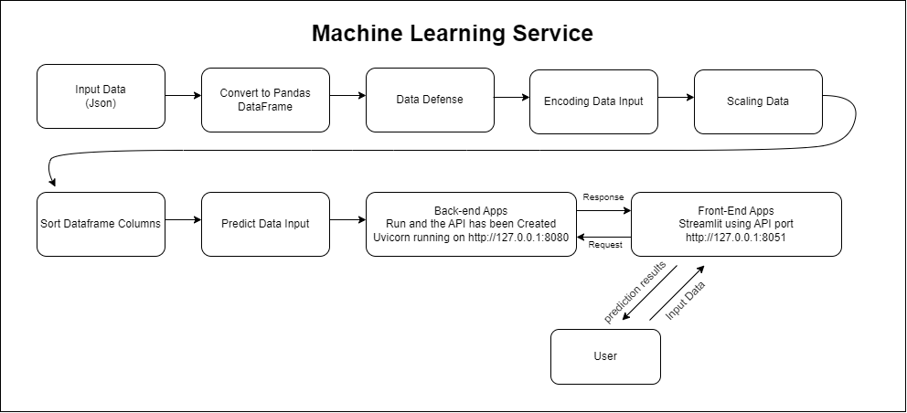
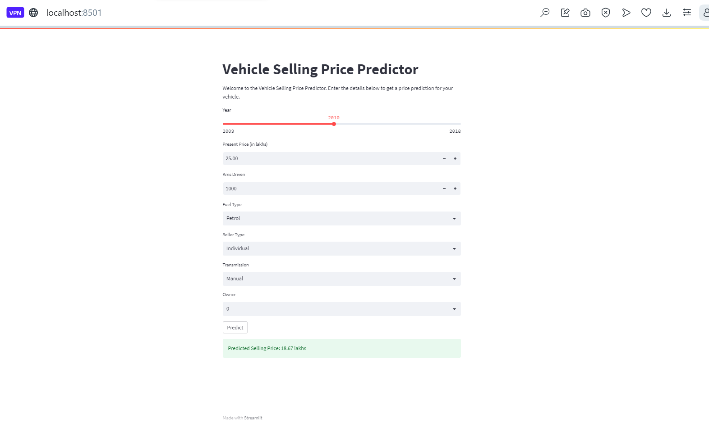

# Predicting Vehicle Prices using XGBoostRegressor

## Business Problem

Dalam dunia yang terus berkembang dan berubah dengan cepat, industri otomotif tidak luput dari perubahan dinamis. Bagi perusahaan yang beroperasi dalam penjualan kendaraan, memiliki pemahaman yang kuat tentang bagaimana menentukan harga kendaraan secara akurat adalah kunci kesuksesan. Pelanggan modern mengharapkan harga yang adil dan transparan, sementara persaingan di pasar mobil yang kompetitif memaksa perusahaan untuk menjalankan operasi dengan efisiensi tinggi.

Namun, menentukan harga yang tepat untuk kendaraan bukanlah tugas yang mudah. Banyak faktor yang memengaruhi nilai kendaraan, seperti merek, model, tahun produksi, jarak tempuh, jenis bahan bakar, tipe seller, transmisi, dan jumlah kepemilikan kendaraan sebelumnya. Variabilitas dalam data ini dapat membuat harga yang sangat bervariasi, dan kesalahan dalam menentukan harga dapat memiliki dampak yang signifikan pada laba dan kepuasan pelanggan.

Inilah mengapa penggunaan teknologi machine learning menjadi semakin penting dalam industri otomotif. Dengan memanfaatkan algoritma machine learning regresi, perusahaan dapat memprediksi harga kendaraan berdasarkan karakteristik yang ada dalam dataset. Dengan kata lain, kami memiliki kemampuan untuk memberikan estimasi harga yang lebih akurat kepada pelanggan kami, yang pada gilirannya akan memberikan keuntungan besar dalam hal kepuasan pelanggan dan efisiensi operasional.

## Business Objective

Dalam konteks penggunaan machine learning regression untuk memprediksi harga kendaraan, tujuan bisnis kami adalah meningkatkan efisiensi dan profitabilitas dalam bisnis otomotif kami. Kami ingin mencapai hal ini dengan beberapa cara:

1. `Optimasi Harga`: Kami berusaha untuk menetapkan harga kendaraan yang sesuai dengan nilai sebenarnya, menghindari harga yang terlalu tinggi yang dapat menghalangi pembeli potensial atau harga terlalu rendah yang dapat mengurangi keuntungan.
2. `Peningkatan Keuntungan`: Dengan memprediksi harga dengan lebih akurat, kami berharap untuk meningkatkan margin laba kami dan mencapai keuntungan yang lebih tinggi dari penjualan kendaraan.
3. `Pengalaman Pelanggan yang Lebih Baik`: Kami ingin memberikan pelanggan pengalaman yang lebih baik dengan menawarkan harga yang lebih adil dan kompetitif, membangun kepuasan pelanggan yang lebih besar.
4. `Pengambilan Keputusan yang Terinformasi`: Kami berharap untuk membuat keputusan yang lebih terinformasi terkait dengan persediaan kendaraan, strategi penetapan harga, dan manajemen rantai pasokan.
5. `Mempertahankan Daya Saing`: Kami ingin tetap menjadi pesaing yang kuat di pasar otomotif yang kompetitif ini, terus beradaptasi dengan perubahan pasar.
6. `Inovasi dan Pertumbuhan Berkelanjutan`: Kami akan terus memperbarui dan meningkatkan model machine learning kami untuk mendorong inovasi dan pertumbuhan berkelanjutan dalam bisnis kami.

Dengan mencapai tujuan-tujuan ini, kami berharap untuk mengoptimalkan operasi kami, memuaskan pelanggan kami, dan tetap menjadi pemain kunci di industri otomotif.

## Business Metrics

Dalam rangka mencapai tujuan bisnis kami yang terkait dengan prediksi harga kendaraan menggunakan machine learning regression, kami telah menentukan sejumlah metrik bisnis yang akan kami gunakan untuk mengukur kesuksesan proyek ini. Beberapa metrik kunci yang relevan adalah:

1. `Margin Laba`: Salah satu metrik bisnis utama adalah margin laba kami. Kami ingin melihat peningkatan dalam margin laba kami sebagai hasil dari penggunaan model ini untuk mengoptimalkan harga kendaraan.
2. `Tingkat Konversi`: Kami akan memonitor tingkat konversi pembeli potensial menjadi pembeli sebenarnya setelah menerapkan model ini. Kami berharap harga yang lebih akurat dapat meningkatkan tingkat konversi.
3. `Kepuasan Pelanggan`: Kami akan melakukan survei dan mengumpulkan umpan balik pelanggan untuk mengukur tingkat kepuasan mereka terhadap harga yang kami tawarkan.
4. `Peningkatan Keuntungan`: Peningkatan laba kotor dan laba bersih menjadi metrik utama dalam mengukur keberhasilan bisnis kami yang dapat dicapai dengan model ini.

Dengan memantau metrik-metrik ini secara berkala, kami akan dapat mengukur dampak positif dari penggunaan machine learning regression dalam memprediksi harga kendaraan dan memastikan bahwa proyek ini berkontribusi secara positif terhadap tujuan bisnis kami.

## Machine Learning Solution

Untuk mengatasi tantangan dalam memprediksi harga kendaraan (mobil), kami telah mengimplementasikan solusi machine learning menggunakan teknik regresi. Solusi ini memanfaatkan model regresi, seperti XGBoost Regressor, yang telah dilatih dengan dataset berisi berbagai atribut kendaraan.

Dengan menerapkan solusi machine learning ini, kami berharap dapat meningkatkan akurasi prediksi harga kendaraan kami dan mengoptimalkan keuntungan bisnis kami melalui harga yang lebih baik. Solusi ini juga memungkinkan kami untuk mengikuti tren pasar dan menjaga daya saing dalam industri penjualan kendaraan.

## Machine Learning Metrics

Dalam mengevaluasi kinerja model machine learning kami untuk memprediksi harga kendaraan menggunakan XGBoost Regressor, kami memanfaatkan metrik bisnis utama yaitu `Mean Absolute Error (MAE)`.

`MAE` mengukur sejauh mana perbedaan antara harga yang diprediksi oleh model dengan harga sebenarnya pada dataset uji. Metrik ini diukur dalam unit mata uang (misalnya, dalam kasus ini, dalam satuan “lakhs” atau ratus ribu mata uang lokal). Semakin rendah nilai MAE, semakin baik performa model.

Dengan MAE, kami dapat memberikan estimasi berapa banyak harga rata-rata model kami akan berbeda dari harga sebenarnya. Ini memberikan gambaran yang jelas tentang seberapa akurat prediksi model kami dalam menghargai kendaraan.

Sebagai contoh, jika MAE adalah 1.0 lakhs, ini berarti rata-rata prediksi kami akan memiliki perbedaan sekitar 1.0 lakhs dari harga sebenarnya. Dengan pemahaman ini, kami dapat mengukur dan memantau sejauh mana model kami dapat memberikan prediksi harga kendaraan yang akurat, yang sangat penting dalam industri penjualan kendaraan. Semakin mendekati nol MAE, semakin baik kualitas prediksi kami, dan ini membantu meningkatkan kepuasan pelanggan dan profitabilitas bisnis kami.

## Literature Review

**Used Car Price Prediction with Random Forest Regressor Model**

Penelitian tersebut bertujuan untuk melakukan prediksi harga mobil dengan jumlah data sebanyak 8128 data dan 13 atribut yang bersumber dari Kaggle. Evaluasi metrics machine learning regresi pada penelitian ini menggunakan MAE dan RMSE dengan hasil model terbaik yakni Random Forest pada ekperiment menghasilkan tingkat error MAE=1,006 dan RMSE=1,452. (Kriswantara & Sadikin, 2022)

**Using machine learning methods to predict electric vehicles penetration in the automotive market**

Penelitian ini kumpulan data utama berisi penjualan bulanan dan registrasi 357 kendaraan baru di Amerika Serikat Amerika dari tahun 2014 hingga 2020. Evaluasi metrics machine learning regresi pada penelitian ini Mean Absolute Percentage Error, Normalized Root Mean Square Error, R-square, slope, and intercept of ftted linear regressions. Dalam upaya memprediksi penjualan, penelitian ini menggunakan beberapa model, termasuk LSTM (Long Short-Term Memory) dan ConvLSTM (Convolutional LSTM). Untuk meningkatkan kinerja LSTM, penelitian ini mengusulkan model hibrida baru yang disebut “Hybrid LSTM dengan perhatian dua dimensi dan jaringan residual”. Semua model dalam penelitian ini dikembangkan sebagai model Pembelajaran Mesin Otomatis (AutoML) untuk meningkatkan proses pemodelan. Model hibrida yang diusulkan mampu memprediksi pangsa pasar EV dengan Mean Absolute Error yang dapat diterima sebesar 3.5%. (Afandizadeh et al., 2023)

**Predicting Resale Car Prices Using Machine Learning Regression Models With Ensemble Techniques**

Dalam paper ini, dikembangkan beberapa model yaitu Multiple Linear Regression, KNN, Random Forest, Gradient Boosting, dan XGBoost, dan hasilnya dibandingkan untuk akurasi. Dari semua model tersebut, XGBoost memberikan nilai r2 tertinggi, yaitu 88% untuk data pelatihan dan 87% untuk data uji. (Krishnan & Selvaraj, 2022)

**Using Linear Regression For Used Car Price Prediction**

Dalam penelitian ini, efektivitas model regresi linear dieksplorasi untuk memprediksi harga mobil bekas. Model regresi linear diterapkan pada dataset yang berisi fitur-fitur dan informasi harga kendaraan di Turki pada tahun 2020. Sebagai hasilnya, memilih 1/3 dari dataset sebagai data uji, ternyata skor R2 untuk keberhasilan prediksi model adalah 73%. Untuk meningkatkan efektivitas hasilnya, dataset dapat diperluas atau bagian pra-pemrosesan dapat diperinci lebih detail. (MUTİ & YILDIZ, 2023)

## Alur Transformasi Data (End to End Machine Learning Process)

## Data Preparation

**Gambar Arsitektur Data Preparation**


### Data Definition
Data yang digunakan merupakan data yang menggambarkan karakteristik vehicle berdasarkan harga jualnya. adapun fitur karakteristik vehicle yang digunakan antara lain

Predicting Vehicle Prices saat ini menggunakan data yang disadur dari kaggle dengan laman :

https://www.kaggle.com/code/anandtalware/vehicle-sale-price-prediction-9-sept-2023/input?select=car+data.csv

Data berisi 301 baris dan 8 kolom yaitu :

* Year : Tahun saat mobil tersebut dibeli
* Selling_Price : Harga saat mobil tersebut dijual
* Present_Price : harga mobil bekas showroom saat ini
* Kms_driven : Jarak tempuh yang sudah dilalui mobil tersebut
* Fuel_Type : Jenis bahan bakar mobil 
* Seller_Type : Tipe Penjual, perorangan atau dealer
* Transmission : Jenis Transmisi oper gigi mobil, manual atau otomatis
* Owner : Jumlah pemilik mobil sebelumnya.

`Year :
[int64]
[2003–2018]
Tahun saat mobil tersebut dibeli`

`Selling_Price :
[float64]
[0.1–35.0]
Harga saat mobil tersebut dijual`

`Present_Price :
[float64]
[0.32–92.6]
Harga mobil bekas showroom saat ini`

`Kms_driven :
[int64]
[500–500000]
Jarak tempuh yang sudah dilalui mobil tersebut`

`Fuel_Type :
[object]
[‘Petrol’ ‘Diesel’ ‘CNG’]
Jenis bahan bakar mobil`

`Seller_Type :
[object]
[‘Dealer’ ‘Individual’]
Tipe Penjual, perorangan atau dealer`

`Transmission :
[object]
[‘Manual’ ‘Automatic’]
Jenis Transmisi oper gigi mobil, manual atau otomatis`

`owner :
[int64]
[0, 1, 3]
Jumlah pemilik mobil sebelumnya.`

Setelah melakukan dataset definition maka setelah itu dilakukan pula data validation dan data splitting yang terdiri dari train set, valid set dan test set, selengkapnya saya lampirkan pada github dilaman paling bawah.

## Exploratory Data Analysis (EDA) 

* Hal ini dilakukan untuk mengekplorasi kondisi data agar data lebih mudah diproses pada Algoritma Machine Learning dan memiliki kinerja model yang baik

** Gambar Arsitektur Exploratory Data Analysis (EDA) **


### Check Skewed Data 


Rules : 

* jika kolom mendapati skewnya sebesar > +- 0.5, maka dari itu kolom tersebut akan diimputasi dengan median
* jika kolom mendapati skewnya sebesar <= +- 0.5 kolom lainnya akan diimputasi dengan mean atau modus

Imputasi Median :

* Kms_Driven
* Present_Price
* Owner

Imputasi Modus :

* Year                    

“Year” semestinya masuk dalam kategori imputasi mean. Namun, karena year jika dirata ratakan hasilnya tidak bulat datanya, dan cenderung menghasilkan data yang bias.

### Distribusi Data

Visualisasi menggunakan kdeplot diatas menghasilkan bentuk distribusi data masing-masing kolom dengan garis merah sebagai garis mean dari kolom data dan warna hijau sebagai garis median dari kolom data.


* Year memiliki bentuk distribusi Left Skewed Distribution
* Kms_Driven, Present_Price, Owner dan Selling_Price memiliki bentuk distribusi Right Skewed Distribution

### Melihat Proporsi Data secara Jumlah dan Persentase

**Melihat Jumlah Proporsi masing masing Kolom Kategori**


**Proporsi data kategori dalam bentuk persentase**


### Correlation Check


korelasi negatif terendah terdapat pada variabel Year dan Kms_Driven sebesar -0.53 dan Present_Price dan Selling_Price memiliki korelasi positif yang tinggi sebesar 0.89

### Outlier Detection


Outlier pada data diatas masih dalam kategori wajar

### Uji Hipotesis

**Membandingkan antar kelompok pada kolom Fuel berdasarkan selling_price**


Dalam hipotesis null, kita berasumsi bahwa tidak ada perbedaan signifikan dalam rata-rata harga jual antara kategori bahan bakar. Hipotesis alternatif menyatakan bahwa setidaknya satu dari rata-rata harga jual dalam kategori bahan bakar berbeda dari yang lainnya, yang mengindikasikan adanya perbedaan signifikan.

Uji Anova kemudian akan digunakan untuk menguji apakah terdapat perbedaan yang signifikan dalam rata-rata harga jual ('selling_price') antara kelompok kategori bahan bakar ('fuel').


Hasil Anova yang Anda sertakan menunjukkan bahwa ada perbedaan signifikan dalam 'selling_price' antara kategori 'fuel'. Untuk memahami lebih lanjut apa arti dari hasil ini, mari kita jelaskan beberapa konsep yang terlibat:

1. **Statistic (Statistik):** Nilai statistik ini adalah hasil dari perhitungan statistik yang digunakan dalam uji Anova. Dalam konteks ini, itu adalah angka 44.02894808090848.

2. **P-value (Nilai P):** P-value adalah nilai probabilitas yang dihasilkan dari uji statistik. Ini mengukur sejauh mana perbedaan yang diamati antara kelompok-kelompok (dalam hal ini, kategori 'Fuel_Type') adalah hasil dari variasi acak atau jika perbedaan tersebut signifikan secara statistik. Pada kasus ini, nilai p-value sangat rendah, yaitu 7.852895544561943e-17 (sangat mendekati nol).

3. **Terdapat perbedaan signifikan:** Ketika p-value sangat rendah (umumnya kurang dari tingkat signifikansi yang telah ditentukan sebelumnya, dalam kasus ini 0.05), kita cenderung menolak hipotesis nol. Hipotesis nol dalam konteks ini adalah bahwa tidak ada perbedaan signifikan antara kelompok-kelompok. Dengan kata lain, hasil ini menunjukkan bahwa ada perbedaan signifikan dalam 'selling_price' antara kategori 'Fuel_Type'.

Dengan kata lain, berdasarkan hasil Anova yang Anda peroleh, dapat disimpulkan bahwa jenis bahan bakar (kategori 'Fuel_Type') memiliki pengaruh yang signifikan terhadap harga jual ('selling_price'). Perbedaan dalam jenis bahan bakar kendaraan dapat secara signifikan mempengaruhi harga penjualan. Hal ini bisa menjadi informasi yang sangat berharga dalam analisis data Anda, terutama jika Anda ingin memahami faktor-faktor apa yang memengaruhi harga jual kendaraan.

**Membandingkan antar kelompok pada kolom seller_type berdasarkan selling_price**


Dalam hipotesis null, kita berasumsi bahwa tidak ada perbedaan signifikan dalam rata-rata harga jual antara kategori jenis penjual. Hipotesis alternatif menyatakan bahwa setidaknya satu dari rata-rata harga jual dalam kategori jenis penjual berbeda dari yang lainnya, yang mengindikasikan adanya perbedaan signifikan.


Hasil Uji Mann-Whitney U yang disajikan menunjukkan bahwa ada perbedaan signifikan dalam 'selling_price' antara kategori 'seller_type'. Untuk menguraikan lebih lanjut arti dari hasil ini, mari kita bahas beberapa konsep penting:

Penjelasan:

1. **U-Statistic (Statistik U)**: Nilai statistik U adalah hasil dari Uji Mann-Whitney U yang digunakan untuk membandingkan median 'selling_price' antara kedua kelompok yang berbeda. Dalam kasus ini, statistik U memiliki nilai sekitar 119.5.

2. **P-value (Nilai P)**: P-value adalah nilai probabilitas yang dihasilkan dari Uji Mann-Whitney U. Ini mengukur sejauh mana perbedaan median 'selling_price' antara kedua kelompok 'seller_type' adalah hasil dari variasi acak atau jika perbedaan tersebut signifikan secara statistik. Nilai P yang sangat rendah, sekitar 5.52e-34, menunjukkan bahwa perbedaan yang diamati sangat tidak mungkin disebabkan oleh kebetulan.

3. **Terdapat perbedaan signifikan**: Ketika nilai P sangat rendah (biasanya lebih rendah dari tingkat signifikansi yang telah ditentukan sebelumnya, dalam kasus ini 0.05), kita dapat menarik kesimpulan bahwa terdapat perbedaan signifikan dalam median 'selling_price' antara kedua kategori 'seller_type'. Artinya, jenis penjual ('seller_type') memengaruhi secara signifikan harga jual ('selling_price') kendaraan.

Hasil ini memiliki implikasi penting dalam analisis data. Ini menunjukkan bahwa jenis penjual yang berbeda, yang mungkin memiliki strategi penjualan yang berbeda atau audiens yang berbeda, dapat memiliki dampak yang signifikan pada median harga jual kendaraan. Dengan pemahaman ini, bisnis atau organisasi dapat mengambil tindakan yang sesuai, seperti menyesuaikan strategi harga atau pemasaran berdasarkan jenis penjual untuk mengoptimalkan penjualan dan keuntungan.

**Membandingkan antar kelompok pada kolom transmission berdasarkan selling_price**


Dalam hipotesis null, kita berasumsi bahwa tidak ada perbedaan signifikan dalam rata-rata harga jual antara kategori transmisi. Hipotesis alternatif menyatakan bahwa setidaknya satu dari rata-rata harga jual dalam kategori transmisi berbeda dari yang lainnya, yang mengindikasikan adanya perbedaan signifikan.


**Hasil Uji Mann-Whitney U**:

- **Statistik U (U-Statistic)**: Nilai statistik U adalah hasil dari Uji Mann-Whitney U yang digunakan untuk membandingkan median 'selling_price' antara kedua kelompok yang berbeda. Dalam kasus ini, statistik U memiliki nilai sebesar 2177.0.

- **P-value (Nilai P)**: P-value adalah nilai probabilitas yang dihasilkan dari Uji Mann-Whitney U. Ini mengukur sejauh mana perbedaan median 'selling_price' antara kedua kelompok 'Manual' dan 'Automatic' pada kolom 'Transmission' adalah hasil dari variasi acak atau jika perbedaan tersebut signifikan secara statistik. Nilai P sekitar 0.0076, yang lebih rendah dari tingkat signifikansi 0.05, menunjukkan bahwa perbedaan median 'selling_price' antara kedua kelompok ini adalah signifikan secara statistik.

- **Terdapat perbedaan signifikan**: Karena nilai P lebih rendah dari tingkat signifikansi yang ditetapkan (0.05), kita dapat menyimpulkan bahwa ada perbedaan signifikan dalam median 'selling_price' antara kelompok 'Manual' dan 'Automatic' pada kolom 'Transmission'. Ini mengindikasikan bahwa jenis transmisi kendaraan ('Transmission') secara signifikan memengaruhi harga jual ('selling_price') kendaraan.

Hasil ini dapat memberikan wawasan berharga dalam pengambilan keputusan terkait dengan jenis transmisi kendaraan, seperti penentuan harga atau strategi pemasaran yang lebih tepat untuk masing-masing jenis transmisi.

**Membandingkan antar kelompok pada kolom owner berdasarkan selling_price**


Dalam hipotesis null, kita berasumsi bahwa tidak ada perbedaan signifikan dalam rata-rata harga jual antara kategori kepemilikan. Hipotesis alternatif menyatakan bahwa setidaknya satu dari rata-rata harga jual dalam kategori kepemilikan berbeda dari yang lainnya, yang mengindikasikan adanya perbedaan signifikan.

Uji Anova kemudian akan digunakan untuk menguji apakah terdapat perbedaan yang signifikan dalam rata-rata harga jual ('selling_price') antara kelompok kategori kepemilikan ('owner').


Hasil Anova yang Anda sajikan menunjukkan bahwa tidak ada perbedaan signifikan dalam 'selling_price' antara berbagai kategori 'owner'. Untuk menguraikan lebih lanjut arti dari hasil ini, mari kita bahas beberapa konsep penting:

1. **Statistic (Statistik)**: Nilai statistik ini adalah hasil dari uji Anova yang digunakan untuk membandingkan rata-rata 'selling_price' antara kelompok-kelompok yang berbeda. Dalam kasus ini, statistik memiliki nilai sekitar 1.35.

2. **P-value (Nilai P)**: P-value adalah nilai probabilitas yang dihasilkan dari uji statistik. Ini mengukur sejauh mana perbedaan dalam 'selling_price' antara kelompok-kelompok 'owner' adalah hasil dari variasi acak atau jika perbedaan tersebut signifikan secara statistik. Nilai P yang cukup tinggi, sekitar 0.26, menunjukkan bahwa perbedaan yang diamati kemungkinan besar disebabkan oleh kebetulan.

3. **Tidak terdapat perbedaan signifikan**: Ketika nilai P tinggi (biasanya lebih tinggi dari tingkat signifikansi yang telah ditentukan sebelumnya, dalam kasus ini 0.05), kita tidak memiliki cukup bukti statistik untuk menyatakan bahwa terdapat perbedaan signifikan dalam 'selling_price' antara kategori 'owner'. Dengan kata lain, jenis owner ('owner') kemungkinan tidak memiliki dampak signifikan pada harga jual ('selling_price') kendaraan berdasarkan data yang dianalisis.

Dalam konteks ini, hasil ini menunjukkan bahwa perbedaan dalam kategori 'owner' tidak begitu penting dalam menjelaskan variasi dalam harga jual kendaraan. Hal ini dapat memandu kebijakan harga atau strategi pemasaran yang lebih umum daripada yang berfokus pada jenis kepemilikan kendaraan.

### Kesimpulan EDA

1. data tidak mengandung missing value

2. Imputasi Modus : Year dan Imputasi Median = Kms_Driven, Present_Price dan Owner

3. Outlier tidak dilakukan handling apapun karena merupakan data yang bisa saja terjadi didunia nyata

4. proporsi data pada kolom Fuel_Type terbanyak disandang oleh mobil yang berbahan bakar Petrol sebanyak 177 dengan persentase 78.67% dan yang terendah ialah CNG sebanyak 1 dengan persentase 0.44%

5. proporsi data pada kolom Seller_Type terbanyak disandang oleh tipe penjual Dealer sebanyak 145 dengan persentase 64.44% dan yang terendah ialah Individual sebanyak 80 dengan persentase 35.56%

6. proporsi data pada kolom Transmission terbanyak disandang oleh tipe transmisi Manual sebanyak 193 dengan persentase 85.78% dan yang terendah ialah Automatic sebanyak 32 dengan persentase 14.22%

7. proporsi data pada kolom owner terbanyak disandang oleh tipe owner 0 sebanyak 216 dengan persentase 96.00% dan yang terendah ialah 3 sebanyak 1 dengan persentase 0.44%

8. Secara korelasi, korelasi negatif terendah terdapat pada variabel Year dan Kms_Driven sebesar -0.53 dan Present_Price dan Selling_Price memiliki korelasi positif yang tinggi sebesar 0.89

9. Setelah dicek menggunakan pengujian anova variabel Fuel_Type, Seller_Type, Transmission yang masing masing value dari kolomnya terdapat perbedaan signifikan dalam rata-rata harga jual atau selling_price, yang berarti masing masing variabel dapat memberikan dampak signifikan terhadap harga jual atau selling_price. Namun variabel Owner tidak memiliki perbedaan signifikan dalam Selling_Price yang berarti variabel Owner tidak memberikan dampak signifikan terhadap harga jual atau selling_price

10. Tren Temporal Selling Price dari masing-masing variabel cenderung mengalami pola fluktuatif

## Data Preprocessing

** Gambar Data Preprocessing **



Setelah mendapatkan mandat dari hasil eksplorasi data diatas maka dilakukan implementasi pada data preprocessing antara lain

1. Handling Missing Value dengan Year, Kms_Driven, Present_Price, dan Owner akan dilakukan imputasi dengan metode median.
2. Get Dummies pada Kolom Fuel_Type, Seller_Type, dan Transmission


Setelah melakukan get dummies pada data terlihat kolom Fuel_Type, Seller_Type, dan Transmission sudah berubah bentuk menjadi get_dummies dengan membentuk kolom 7 kolom baru

3. Scaling data pada kolom “Kms_Driven” dan “Present_Price” dan sudah dilakukan sorted data.


4. Data Clean, siap untuk dilanjutkan pada tahap pemodelan

## Data Modeling


1. Setelah melakukan Data Preprocessing, hasilnya akan dilakukan pemodelan agar bisa memprediksi harga kendaraan

2. Pemodelan Regression akan menggunakan metode Experiment, dan model yang terbaik adalah model XGBoostRegressor dengan tunning parameter dengan GridsearchCV

### XGBoost Regressor: Gradient Boosting for Regression

XGBoost (Extreme Gradient Boosting) adalah salah satu algoritma machine learning yang sangat efektif untuk tugas regresi. Algoritma ini beroperasi menggunakan teknik Gradient Boosting, yang merupakan metode ensemble learning. XGBoost membangun sejumlah decision tree secara sekuensial, dengan setiap tree berfungsi untuk memperbaiki hasil prediksi dari tree sebelumnya. Ini adalah pendekatan yang sangat kuat untuk memodelkan hubungan antara fitur-fitur input dan target regresi.

Berikut adalah cara XGBoost Regressor bekerja dalam konteks pemodelan regresi:

* **Pembangunan Decision Tree**: XGBoost membangun sejumlah decision tree secara berurutan. Setiap tree bertujuan untuk memperbaiki hasil prediksi dari tree sebelumnya.

* **Loss Function**: Untuk mengukur sejauh mana hasil prediksi dari model mendekati nilai aktual, XGBoost menggunakan loss function. Dalam regresi, mean squared error (MSE) sering digunakan sebagai loss function. Rumus matematis untuk MSE adalah:


Rumus ini digunakan untuk mengukur seberapa baik model regresi memodelkan data aktual dengan meminimalkan jumlah kuadrat selisih antara nilai aktual (y_i) dan nilai prediksi (ŷ_i) untuk semua sampel (i).

* **Optimisasi Objective Function**: Selama proses pelatihan, XGBoost melakukan optimisasi terhadap objective function. Objective function ini berusaha meminimalkan kesalahan antara prediksi dan nilai aktual dengan menambahkan sejumlah decision tree.

Rumus matematis untuk objective function dalam regresi dengan XGBoost adalah sebagai berikut:


Selama pelatihan, XGBoost menggunakan teknik optimisasi gradient descent. Setiap decision tree yang ditambahkan pada model membantu memperbaiki prediksi dari tree sebelumnya dengan menambahkan residual error dari iterasi sebelumnya pada setiap label target. Pada akhir iterasi, XGBoost menghasilkan prediksi regresi final berupa nilai kontinu untuk masing-masing sampel dalam data uji.

Dengan teknik-teknik seperti pembelajaran berbasis histogram dan pruning, XGBoost sering dianggap sebagai salah satu algoritma terbaik untuk regresi. Itu juga dapat digunakan untuk tugas klasifikasi dan ranking.

**Tuning Parameter dengan GridSearchCV**

GridSearchCV adalah alat yang sangat berguna untuk mengoptimalkan model XGBoost dalam konteks regresi. Ini memungkinkan pencarian sistematis dari kombinasi parameter terbaik untuk meningkatkan kinerja model. Prosesnya adalah sebagai berikut:

1. **Pilih Parameter yang Akan Diuji**: Pertama, kita memilih parameter apa yang ingin kita optimalkan, seperti `learning_rate`, `max_depth`, `n_estimators`, dan lainnya.

2. **Definisikan Rentang Nilai**: Kemudian, kita menentukan rentang nilai yang ingin diuji untuk setiap parameter. Misalnya, `learning_rate` mungkin diuji pada nilai [0.01, 0.1, 0.2], `max_depth` pada nilai [3, 4, 5], dan seterusnya.

3. **Lakukan Pencarian**: GridSearchCV akan melakukan pencarian sistematis, menguji setiap kombinasi parameter dalam "grid" yang telah ditentukan. Ini berarti mencoba semua kemungkinan kombinasi parameter.

4. **Evaluasi Kinerja**: Setiap kombinasi parameter akan dievaluasi dengan metrik kinerja yang telah ditentukan, seperti MSE dalam kasus regresi. Kombinasi yang memberikan kinerja terbaik pada data validasi akan dipilih sebagai parameter terbaik.

Dengan demikian, penggunaan XGBoost Regressor dan tuning parameter menggunakan GridSearchCV adalah pendekatan yang sangat efektif untuk membangun model regresi yang sangat akurat untuk masalah yang rumit. 

### Experiment Model Result


### Best Model Result


```
Parameter Terbaik:
{'colsample_bytree': 1.0, 'max_depth': None, 'min_child_weight': 1, 'n_estimators': 50, 'subsample': 0.8}
```

Diatas merupakan parameter terbaik untuk pemodelan XGBoostRegressor, yang menghasilkan metrics sebagai berikut :

```
MAE (Mean Absolute Error) Train:  0.04091571565336652
MAE (Mean Absolute Error) Test:  0.5076566367679173
MAE (Mean Absolute Error) Valid:  0.4070950624827415
```

Hasil tersebut dirasa sudah cukup baik untuk memprediksi selling_price dari kendaraan, karena metrics MAE cenderung memiliki nilai yang kecil, yang dimana semakin kecil nilai MAE maka model akan semakin baik memprediksi

Observasi:

* Performa model cukup baik ketika memprediksi selling_price pada rentang data 0 –15
* jika diatas 15 maka performa akan turun

Action:

* EDA data-data dengan selling_price yang terlalu tinggi
* Perlu penambahan data dengan value diatas 15 agar model dapat mempelajari data dengan lebih baik

## Machine Learning Services




Selanjutnya, setelah melalui beberapa proses dan model telah di save akan dilanjutkan pada deployment dengan menggunakan API dan Streamlit gambar dibawah ini merupakan contoh mengakses menggunakan ML Services melalui FAST API Swagger UI

Berikut contoh input data yang digunakan untuk mengakses API


Berikut hasil output prediksi dari API services


Agar lebih ramah dalam menggunakannya dan tampilannya lebih powerfull, user disuguhkan dengan apps sederhana yang dibangun dengan menggunakan streamlit services, berikut contoh penggunaannya



User diharapkan mengisi form yang sudah disediakan hingga selesai, jika terdapat kesalahan range dalam input data streamlit akan menampilkan error dibagian mana yang inputnya salah, jika dirasa sudah sesuai kriteria maka klik tombol `predict` dan akan mengelarkan hasil prediksi harga kendaraan.

### Menggunakan Docker Container
Ketika service ingin dijalankan bersamaan, maka kita perlu menggunakan tools yang mendukung hal tersebut, salah satunya dapat menggunakan docker berikut contoh service sederhana yang dijalankan dengan bantuan docker


## Cara Menjalankan Service

### Cara menjalankan Script Dilokal dengan Dua Terminal Sekaligus

#### Konfigurasi Awal
- Buat satu folder untuk clone file-file yang tersedia pada laman github ini
- clone repository github ini
- instalasi virtual environment
- aktifkan virtual environment yang telah dibuat
- install requirements.txt dengan cara `pip install -r requirements.txt`
- file sudah dikonfigurasi, lanjutkan step dibawah ini sesuai dengan keinginan

#### Cara Menjalankan API

- Pastikan masuk ke folder utama program
- ketik - `python src/api.py`
- lalu akan dirujuk pada laman `http://127.0.0.1:8080`

#### Cara Menjalankan Streamlit
- edit pada file src/streamlit pada bagian dari yang sebelumnya 
- `response = requests.post("http://api:8080/predict/", json=data)` menjadi ini
- `response = requests.post("http://localhost:8080/predict/", json=data)`
- Pastikan masuk ke folder utama program
- ketik - `streamlit run src/streamlit.py`
- lalu akan diarahkan pada tampilan UI streamlit pada laman `http://localhost:8501/`

#### Cara serve MkDocs
- Pastikan sudah berada didalam folder docs
- ketik - `mkdocs serve`
- lalu laman dokumen akan muncul pada laman `http://127.0.0.1:8000`

### Cara menjalankan Sevice dengan menggunakan Docker

Langkah langkah menggunakan menjalankan service dengan menggunakan docker:

* pastikan docker sudah diaktifkan dan dalam kondisi login
* lalu, jalankan melalui terminal yang sudah diaktifkan virtual environment dengan script berikut `docker compose up -d --build`
* pastikan script `src/streamlit` pada pemanggilan api menggunakan script dibawah ini
`response = requests.post("http://api:8080/predict/", json=data)`
* Selesai service sudah bisa digunakan

## Kesimpulan

* Dalam project ini, dataset untuk memprediksi Selling_Price kendaraan antara lain menggunakan variabel Year, Present_Price, Kms_Driven, Fuel_Type, Seller_Type, Transmission, Owner.
* Project ini turut melakukan eksperimentasi model untuk mendapatkan model yang optimal dalam memprediksi Selling_Price dari kendaraan, setelah melakukan eksperimentasi, model XGBoost dengan Parameter Tunning ditetapkan sebagai model terbaik yang digunakan untuk proses production atau deployment model dengan hasil evaluation metrics MAE (Mean Absolute Error) Train: 0.0409, MAE (Mean Absolute Error) Test: 0.508, MAE (Mean Absolute Error) Valid: 0.407. Dengan parameter terbaik {‘colsample_bytree’: 1.0, ‘max_depth’: None, ‘min_child_weight’: 1, ‘n_estimators’: 50, ‘subsample’: 0.8}. Hasil Pemodelan tersebut dirasa cukup representatif untuk digunakan untuk memprediksi Selling_Price.
* Pada Observasi error analysis Performa model cukup baik ketika memprediksi selling_price pada rentang data 0 –15 jika diatas 15 maka performa akan turun walau tidak signifikan dengan demikian pada EDA data-data dengan selling_price yang terlalu tinggi, Perlu penambahan data dengan value diatas 15 agar model dapat mempelajari data dengan lebih baik

### Future Works

* Dapat menggunakan data yang bisa discrap dari beberapa situs penjualan mobil bekas, dan dapat pula mengeksplorasi lebih dalam untuk penggunaan deep learning seperti yang telah saya sampaikan pada literature review diatas. Penambahan variabel dapat pula dilakukan agar lebih detail kondisi mobil yang akan diprediksi. Setelah dilakukan deployment pada local, dapat pula dilanjutkan pada tahap deployment server agar lebih berguna untuk khalayak.

## Reference

* https://machinelearningmastery.com/xgboost-for-regression/
* https://xgboost.readthedocs.io/en/stable/parameter.html
* https://towardsdatascience.com/xgboost-theory-and-practice-fb8912930ad6
* https://medium.com/hoyalytics/xgboost-theory-and-application-4801a5dba4fb
* Afandizadeh, S., Sharifi, D., Kalantari, N., & Mirzahossein, H. (2023). Using machine learning methods to predict electric vehicles penetration in the automotive market. Scientific Reports, 13(1). https://doi.org/10.1038/s41598-023-35366-3
* Krishnan, J. R., & Selvaraj, V. (2022). Predicting Resale Car Prices Using Machine Learning Regression Models With Ensemble Techniques. AIP Conference Proceedings, 2516. https://doi.org/10.1063/5.0108560
* Kriswantara, B., & Sadikin, R. (2022). Used Car Price Prediction with Random Forest Regressor Model. Journal of Information Systems, Informatics and Computing Issue Period, 6(1), 40–49. https://doi.org/10.52362/jisicom.v6i1.752
* MUTİ, S., & YILDIZ, K. (2023). Using Linear Regression For Used Car Price Prediction. International Journal of Computational and Experimental Science and Engineering, 9(1), 11–16. https://doi.org/10.22399/ijcesen.1070505
